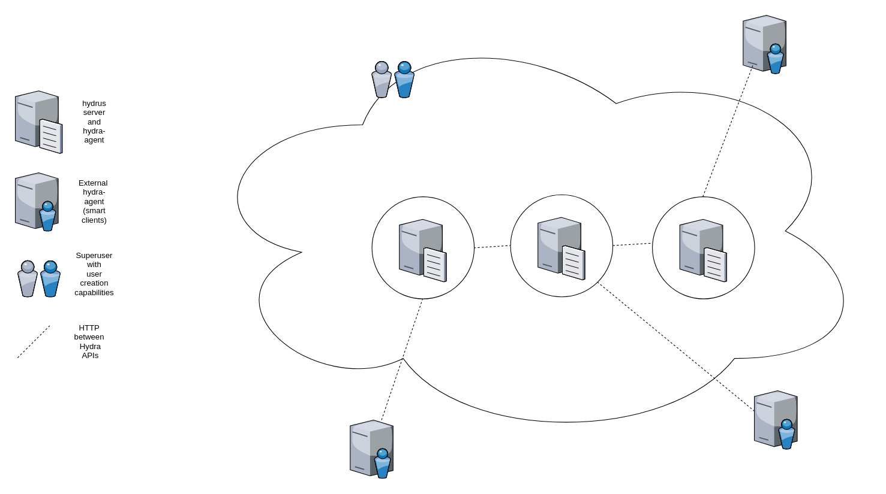
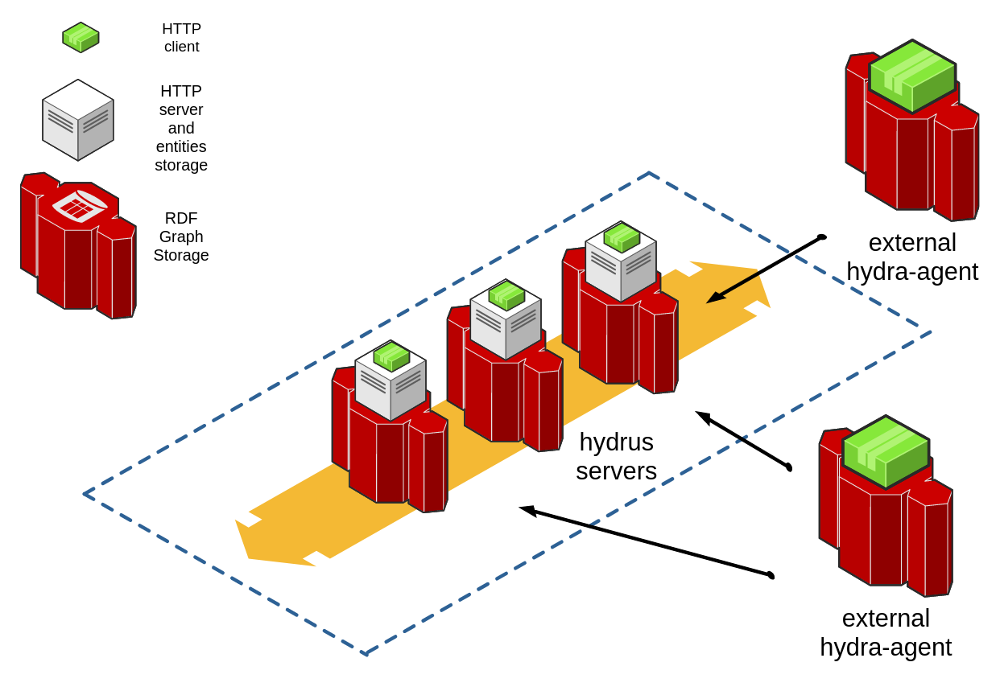

# Design

This page explains the design, architecture and the implementation of [**hydrus**](https://github.com/HTTP-APIs/hydrus) toolkit along with a few use cases for the same. Also the interactions and internals of a smart client ([**hydra-agent**](https://github.com/HTTP-APIs/python-hydra-agent)) connecting to the server are considered.

## REST to Hydra to hydrus
To understand how [hydrus](https://github.com/HTTP-APIs/hydrus) represents REST resources and how the developer is helped to work with Hydra, it is possible to
 start from thinking at Hydra as generic framework that describes REST API resources to make data exchanges automated.

### An instance and its classes
Instances belonging to a Resource are named `Item`s in [hydrus](https://github.com/HTTP-APIs/hydrus). It is possible to perform HTTP operations over `Item`s. At a slightly more abstract layer, the REST Resource is of a kind of an `hydra:Resource`, all the instances of the same resource are members of an `hydra:Collection`. As Hydra inherits from RDF, thanks to the framework it is possible to represent the API as a RDF graph.

### the ecosystem: servers and smart clients
[hydrus](https://github.com/HTTP-APIs/hydrus) allows the developer to take advantage of this powerful description by abstracting away the complexity of RDF and to work on the REST interface layer.

[hydra-agent](https://github.com/HTTP-APIs/python-hydra-agent) interacts with one or more hydrus instances to represent and navigate resources for the sake of data consumption. The client-side tools in the ecosystem are basically any client that complies with [Hydra's specs](https://github.com/HydraCG/Specifications), starting from the [official Typescript implementation Heracles.ts](https://github.com/HydraCG/Heracles.ts) and the [python-hydra-agent](https://github.com/HTTP-APIs/python-hydra-agent).

The tools in the ecosystem works on top of a distributed architecture that is described below from its foundationals classes in the ORM to the interface layer.


Table of contents
-------------
* [RDF and Hydra](#rdf)
* [hydrus-based cloud system](#cloudsystem)
* [hydrus full stack](#fullstack)
* [Multi-layered Database Design](#dbdesign)
* [Data flow](#dataflow)
* [Use cases](#usecase)

<a name="rdf"></a>
### RDF
For a short overview of RDF and Hydra see [Home](00-Home.md).


<a name="cloudsystem"></a>
### Example: hydrus as a cloud system

[hydrus](https://github.com/HTTP-APIs/hydrus) servers are highly decoupled web servers that allows installation of multiple services in parallel. This is possible
by-design as every hydrus instance is automatically querable by Hydra smart client (e.g. python-hydra-agent). An hydrus system can be composed of single server or a multiplicity.
Whatever is the system's layout, a superuser/developer that carries on the activities of engineering and developing the system can manage access privileges to the APIs in the system. External smart clients can query the APIs in the system, according to the privileges defined by the superuser. Here a simple diagram
of a cloud deployment with three hydrus "module-servers" and three external smart clients:




<a name="fullstack"></a>
### Hydra-based data networks

The different [hydrus](https://github.com/HTTP-APIs/hydrus) "modules" that build up an hydrus cloud deployment are designed to be highly decoupled Hydra-aware APIs.
Design of the APIs follows the Hydra draft so that smart clients querying capabilities can be deployed on the hydrus-powered services. Here an example of a Hydra network in a simple diagram:



The different hydrus instances-servers are designed in the same cloud, any Hydra-aware client with the right privileges can access the `ApiDoc` and the data in the servers and build its own representation of the data cloud. hydrus instances may or may not have  attached a client as well, to provide routing or connectivity to data stored in another instance. 

<a name="dbdesign"></a>
### Data storage

#### Server-client data segregation
Data storage capabilities are provided both in the server (hydrus) and in the smart client (hydra-agent) for different puproses:
1. hydrus and its database (the grey box in figure above) hold what we can call the data itsef. The instances of the resources the system is serving. The `ApiDoc` is a JSON-LD string published by the server that describes classes of resources and their relationships (intsances' metadata or schema). This database is a relational database with tables for every class, the schema of the database is generated by the parsing of the `ApiDoc`.
2. hydra-agent (the green box) and its datastore (the red component) hold the (meta-)data necessary for the client to know where to access and fetch the data. Initially, the datastore is a *graph-store* in which the resources classes and their relationships are stored as a graph. As the smart client discovers the servers in the network, the graph is enriched by the resources found in other `ApiDoc` (metadata is stored by parsing documentation strings). When the smart client starts fetching instances it can add to the graph the relationships between instances as described by their metadata, acting as a store for triples.

Annotations: the complete data of every instance reached by the client is still only in the server, the client holds its own representation of the state of the metadata. This creates great challenges in terms of data integrity and representations' synchronization. For an overview of the challenge of distributed data networks see [here](https://en.wikipedia.org/wiki/Distributed_data_store). The Hydra ecosystem does not aim to develop a solution for distributed storage but to implement the W3C Hydra Draft, focusing on defining tools for servers-clients or also clients-clients interactions via HTTP leveraging the REST paradigm.

#### A multi-layered data abstraction
The design of both database and datastore takes into account some of the different layers of representations possible using RDF. This multi-layered data layout tries to give tools to fashion representations using metadata and data concepts as useful abstractions.  
Typically, statements (triples) are stored in the Graph according to 4 different types of layers. These layers make up the Knowledge Base that the REST layer queries.

NOTE: for the sake of this text, the following tuple of words are synonims:
* statement is triple
* predicate is property

Entities and properties are assigned to different layers according to their level of abstraction. The most abstract level considered is the one most related to generic most popular RDF ontologies/vocabularies. Getting closer to the REST interface, the levels become less abstract until it is possible to represent relationships between instances or proper objects. This layout is closed, as in any definite Tree-like representation, by terminals or values that store the quantitative values themselves (strings, numbers, any data types). We call properties that relate "classes" to "classes" (like the ones at the most abstract level) as `AbstractProperty` and the others (relating less abstract kind of entities) as `InstanceProperty`.


##### Abstract Layer
**`Class` >> `Property` >> `Class` [`GraphCAC`]**

A statement that links two abstract classes is a "CAC" statement. This is the most abstract level of relationship stored. Two classes are related by a `AbstractProperty` that describes how they relate. 
For example:
* the class of `Fish`es relates with the property `liveHabitat` to the class `WateryHabitat`. 
* Furthermore, if we walk up the the hierarchy in which this relation may be included, the `WateryHabitat` could be in a relation of `rdf:SubclassOf` with `Habitat` as a generic class for all the habitats.
* Furthermore, `HighPressureSubMarineHabitat` could be a `rdf:subClass` of `MarineHabitat` that is itself a subclass of `WateryHabitat`, and so on.
The one above are all considered as `AbstractProperty` for the sake of storing them in hydrus' datastore.

This is a generic overview of how RDF works to relate classes of objects. This logic works also with instances of objects (the fish named Joy is of kind Acanthurus coeruleus); also families and kinds of objects can be represented as classes. Very generic kind of classes (like classes of relations) are described in vocabularies called "upper-ontologies".

Paragraphs below describe less abstract statements.


##### Infralayer between resources and classes
**`Resource` >> `Property` >> `Class` [`GraphIAC`]**

A statement that links a Resource to an abstract class is a "IAC" statement. A Resource can be also seen as an instance representing a collection of instances (not a class in the abstract, but a more concrete set/group of objects). In the REST layer a Resource is addrressed as `Items`. This kind of entity relates to an abstract class as the ones described in the "CAC" group. This class of statements are stored in the "Graph IAC".
For example:
* the Resource that is the collection of `Fish` and the Resource that is the collection of `Mollusca` have both a property `liveHabitat` that points to `WateryHabitat`

##### Resources layer
**`Resource` >> `Property` >> `Resource` [`GraphIII`]**

A statement that relates two instances or collections of items is a "III" statement. In this layer and in the ones described below, properties are meant to be of kind `InstanceProperty`.
For example:
* an instance of Resource/Class `Fish` can have a property `sameHabitat` pointing to an instance of Resource/Class `Mollusca` because they both lives in the Sargasso Sea. In other words, the fish Joy has the same habitat as the mollusca Rachel. The Knowledge Base express its power as in the same datastore Joy may also be part of multiple statements, like: Joy is of a kind Teleost (an infraclass/family of fishes according to marine biologists).

##### Values layer
**`Resource` >> `Property` >> `Value` [`GraphIIT`]**

A statement that relates an instance to a constant is an "IIT" statement. A `Value` can be a string or a number or any other kind of RDF-supported data types. Usually a value is also a `Terminal` in the sense that it is an entity that state itself and is not related furthermore to an object. Some values are not terminals as may contain a unit of measurement ("2.3 kilos"), in that case the unit of measurement can be itself semantically linked to an entity outside of the instance ("kilos" can be semantically linked to the vocabulary describing Weights and Measures).


#### hydrus diagram

Below is the schema diagram for hydrus database design, instances are stored in tables representing their hierarchical representation:


#### graph-store diagram
(WIP: add diagram for data representation used in `python-hydra-agent`)
...

<a name="dataflow"></a>
### Data Flow
Here is a small illustration as to how data flows in hydrus.

Hydra API Documentation to server endpoints:


RDF/OWL declarations to server endpoints:


<a name="usecase"></a>
### Use cases
This section explains hydrus's design and a use case for the same.
For the demonstration, the server has the [Subsystems](https://github.com/chronos-pramantha/RDFvocab/blob/master/ld%2Bjson/SubSystems.json) and [Spacecraft](https://github.com/chronos-pramantha/RDFvocab/blob/master/ld%2Bjson/Spacecraft.json) vocabularies.

Here is an example of a system used to serve data using the components of hydrus:


**A simple example explaining the use of the above architecture would be:**
* User types in the query “What is the cost of a Thermal Subsystem?”.
* Middleware uses NLP to extract keywords "Thermal Subsystem" and "cost" and maps it to the Hydra instances and properties present at the server.
* Middleware passes these instances and the underlying query to the client.
* Client models a request and uses the API endpoints to extract the given information from the server.
* Server replies with the required value.
* Client serves data to the User.

<!-- ---
### Adding Instances/Resources
To add objects to the instances for a given class, we first need to define a standard way of declaring instances.
We have given an example of a subsystem instance below
```python
instance = {
    "name": "12W communication",    # The name of the instance must be in "name"
    "object": {
        # The "object" key contains all the properties and their values for a given instance
        "maxWorkingTemperature": 63,    # InstanceProperty: Value, Value is automatically converted to Terminal Object

        # In case the Value for a property is another Resource, we use the following syntax
        "hasDuplicate":{
            "@id": "subsystem/34"   # The "@id" tag gives the ID of the other instance
        }

        # In case the property is an AbstractProperty, the class name should be given as Value
        "@type": "Spacecraft_Communication",     # AbstractProperty: Classname, Classname is automatically mapped to relevant RDFClass
    }
}

```
Once we have defined such an `instance`, we can use the built-in CRUD operations of hydrus to add these instances.
```python
from hydrus.data import crud

crud.insert(object_=instance)   # This will insert 'instance' into Instance and all other information into Graph.

# Optionally, we can specify the ID of an instance if it is not already used
crud.insert(object_=instance, id_=1)    #This will insert 'instance' with ID = 1  
```

<a name="moddata"></a>
## Manipulating data
We already saw how insertion works in the "Adding instance" section, we will now see how the other crud operations work and what are the errors and exceptions for each of them.

<a name="crud"></a>
### CRUD opertions
Apart from insertion (create/insert), the CRUD operations also support get (read), delete and update operations. Here are examples for all three:

GET
```python
from hydrus.data import crud
import json

instance = crud.get(id_=1, type_="Spacecraft_Communication")     # Return the Resource/Instance with ID = 1
print(json.dumps(instance, indent=4))
# Output:
# {
#     "name": "12W communication",
#     "object": {
#         "@type": "Spacecraft_Communication",
#         "hasMass": 98,
#         "hasMonetaryValue": 6604,
#         "hasPower": -61,
#         "hasVolume": 99,
#         "maxWorkingTemperature": 63,
#         "minWorkingTemperature": -26
#     }
# }
```
DELETE
```python
from hydrus.data import crud
import json

output = crud.delete(id_=1, type_="Spacecraft_Communication")     # Deletes the Resource/Instance with ID = 1
print(json.dumps(output, indent=4))
# Output:
# {
#   204: "Object with ID : 1 successfully deleted!"
# }
```
UPDATE
```python
from hydrus.data import crud
import json

new_object = {
    "name": "14W communication",
    "object": {
        "@type": "Spacecraft_Thermal",
        "hasMass": 8,
        "hasMonetaryValue": 6204,
        "hasPower": -10,
        "hasVolume": 200,
        "maxWorkingTemperature": 63,
        "minWorkingTemperature": -26
    }
}
output = crud.update(id_=1, object_=new_object)     # Updates the Resource/Instance with ID = 1 with new_object
print(json.dumps(output, indent=4))
# Output:
# {
#   204: "Object with ID : 1 successfully updated!"
# }
```
---
<a name="error"></a>
### Exceptions
The CRUD operations have a number of checks and conditions in place to ensure validity of data. Here are the exceptions that are returned for each of the operations when these conditions are violated.
NOTE: Relevant all responses are returned in JSON format

GET
```python

# A 401 error is returned when a given AbstractProperty: Classname pair has an invalid/undefined RDFClass
{   
    401: "The class dummyClass is not a valid/defined RDFClass"
}

# A 404 error is returned when an Instance is not found
{
    404: "Instance with ID : 2 NOT FOUND"
}

```

INSERT/CREATE
```python
# A 400 error is returned when an instance with a given ID already exists
{
    400: "Instance with ID : 1 already exists"
}

# A 401 error is returned when a given AbstractProperty: Classname pair has an invalid/undefined RDFClass
{   
    401: "The class dummyClass is not a valid/defined RDFClass"
}

# A 402 error is returned when a given Property: Value pair has an invalid/undefined Property
{
    402: "The property dummyProp is not a valid/defined Property"
}

# A 403 error is returned when a given InstanceProperty: Instance pair has an invalid/undefined Instance ID
{   
    403: "The instance 2 is not a valid Instance"
}
```

DELETE
```python

# A 401 error is returned when a given AbstractProperty: Classname pair has an invalid/undefined RDFClass
{   
    401: "The class dummyClass is not a valid/defined RDFClass"
}

# A 404 error is returned when an Instance is not found
{
    404: "Instance with ID : 2 NOT FOUND"
}
```

The update operation is a combination of a delete and an insert operation. All exceptions for both the operation are inherited by update.
 -->
